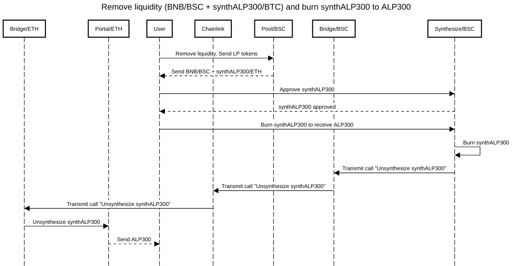

Simplifi frontend app
===

The application is inherited from PancakeSwap application. 

Added the ability to use two web3 connections simultaneously, 
download the lists of tokens for each chain, implemented interactions with dex contracts to: 
1. add liquidity;
2. remove liquidity; 
3. swap tokens from one chain to another.

Sequence diagrams
===

**Add liquidity**

Link to diagram presentation - http://is.gd/JYtC2v

---

**Swap**

Link to diagram presentation - http://is.gd/63CbQ6

---

**Remove liquidity**

Link to diagram presentation - http://is.gd/3srkHM